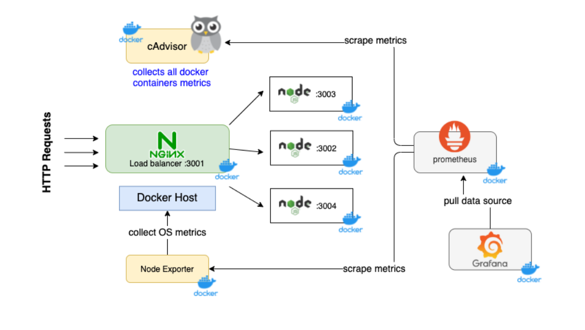
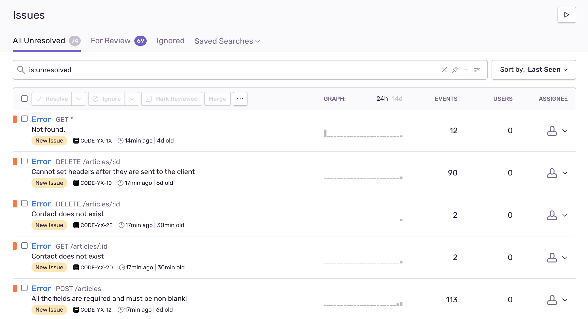
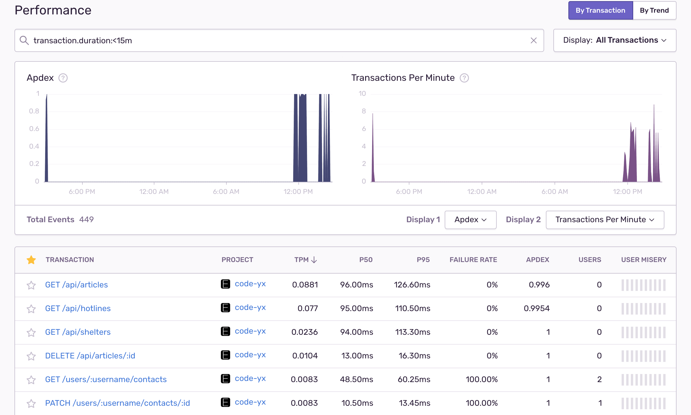
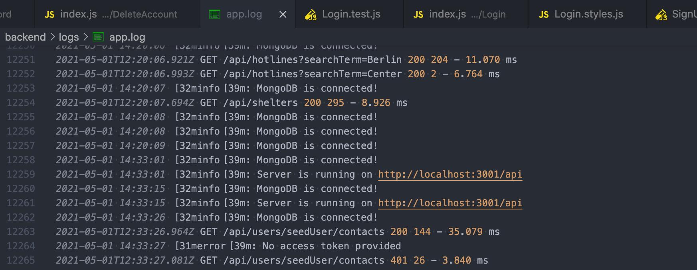

[](https://depfu.com/github/no-domestic-violence/backend?project_id=17563)
[](https://depfu.com/github/no-domestic-violence/backend?project_id=17563)

## Table of contents

- [Project Description](#project-description)
- [Tech Stack](#tech-stack)
- [Application architecture diagram](#application-architecture-diagram)
- [Data Model](#--data-model)
- [Folder structure](#folder-structure)
- [Setup](#setup)
- [Authors of the project](#authors-of-the-project)

## Project Description

POOL project is a mobile application that aims to help the survivors of domestic violence. The main features of the app are: resources in forms of curated articles, videos & podcasts about intimate partner violence, finding shelters and hotlines. Signed up users can have additional access to emergency contact features.

**The api uses Heroku for production**

- Production URL: https://pool-api-mobile.herokuapp.com/api/
- Not protected endpoints: /shelters, /hotlines

## Tech Stack

- Node.js
- Express
- Mongoose
- Mongo DB
- Json Web Token
- Jest
- Heroku

## Application Architecture Diagram


The components implements the following functionalities:

- React Native: User registration, login, browse educational resources and add/delete bookmarks, search hotlines and shelters on map, show/create/edit/remove emergency contacts.
- Express/node.js server: Abstracts access to database for clients with RESTful API using Mongoose library: user management (login, register, delete, authorization of different roles), emergency contact management (read, add, edit, remove), articles (read, add, edit, remove), videos, shelters, hotlines.
- MongoDB database: stores the user related data (login credentials, emergency contacts), geospatial data for shelters, resources, hotlines, and T&C.

## Data Model

Why NoSQL ?

###

The main reasons for choosing MongoDB in POOL project are as below:

- Flexibility → Since the Pool project is in the development phase, it does not have fixed data models. Therefore, the database system may need to accommodate frequent design changes and new features.
- Prioritizing scalability over consistency→ The project needs to store dynamic structured data at large scale
- Performing Geolocation Operations → Map is one of the main features of the app which needs frequent and fast geospatial querying.
- Storing large volumes of data without relations → Some of the collections such as shelters, hotlines and resources do not have relations.


Basic users can perform CRUD operations on contacts and bookmarks. Authorized user with editor or admin role can perform CRUD operations on articles, videos, and podcasts.

Contacts document is embedded in the users collection for optimal querying. Since a user can have maximum 2 emergency contacts (one-to-few relationship), the document size would not exceed the limit.

Each article, video, podcast has one or few violence type tags. The number of violence types are limited, thus another collection is not needed.

## API Swagger Documentation

http://pool-api-mobile.herokuapp.com/api-docs/

## Setup

**To run locally**

1. Clone this repo by running the following command:

```s
git clone https://github.com/no-domestic-violence/backend.git
cd backend
```

2. Install dependencies:

```s
yarn install
```

3. Create .env file and add following information:

```s

  mongoURI = mongodb atlas uri
  JWTSecret = JWTSecret uri
  SENTRY = team sentry link
```

4. Start environment

```s
yarn dev
```

5. Open http://localhost:3001/api to view it in the browser.

6. Before merging to master

- check lint and prettier rules

```s
yarn lint
```

- run tests

```s
yarn test
```

**Load Balancing with NGINX and Docker**



1. Build dockerized image of the app

```s
docker build -t load-balanced-app .
```

2. Run the app instances

```s
docker run -e "INSTANCE=First" -p 3002:3001 -d load-balanced-app
docker run -e "INSTANCE=Second" -p 3003:3001 -d load-balanced-app
docker run -e "INSTANCE=Third" -p 3004:3001 -d load-balanced-app
```

3. cd to nginx directory, build and run the load balancer

```s
docker build -t nginx-load-balancer .
docker run -p 3001:80 -d nginx-load-balancer
```

Then the NGINX load balancer on port 3001 distributes the requests to 3 server instances.

**Caching**

1. Install Redis

- On Mac:

```s
brew install redis
```

2. Launch Redis before you run the server

```s
brew services start redis
```

3. Stop Redis

```s
brew services stop redis
```

**Testing**

App uses Jest and supertest (HTTP assertions library)

- Run tests

```s
yarn test
```

**Application monitoring**

App uses Sentry as application monitoring and error tracking.




To monitor docker containers on grafana:

```s
docker-compose up
```

**Aplication logging**

Winston and morgan (HTTP logger) display logs on terminal and logs are collected on a separate log file.




**To use Heroku for development**

1. Check that app is running

```s
heroku local
```

2. To check builds

```s
heroku builds
```

3. To cancel builds

```s
heroku build:cancel
```

---
In order to run https with certificates (locally for one server in development mode):
* generate a private key

openssl genrsa -aes128 -out private.key 2048

* generate a public key from private key

openssl rsa -pubout -in private.key -out public.key

* generate request

openssl req -new  -key private.key -out request.csr

* generate certificate

openssl x509 -req -days 3 -in request.csr -signkey private.key -out certificate.crt

## Authors of the project:

- Soyoon Choi : User(contacts) API, setup error handler, authorization, setup loggers and monitoring, API documentation
- Irina Baeva : Setup production and development environment (yarn, babel, lint),
  API: Articles (Create, Edit, Delete), Hotlines (Get searching), Shelters, Video (including handling multipart/form-data for image), Caching with Redis on development mode, Setup logging and monitoring.
- Behnaz Derakhshani : Authentication (signup, login, changepassword, deleting account) & error handling and expectation, API: Articles(Read), API documentation
