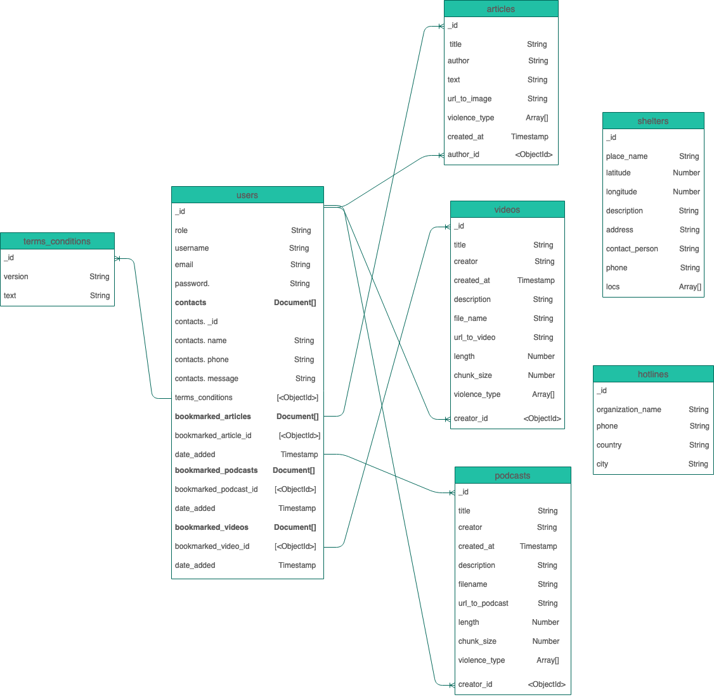

[](https://depfu.com/github/no-domestic-violence/backend?project_id=17563)
[](https://depfu.com/github/no-domestic-violence/backend?project_id=17563)

## Table of contents

- [Project Description](#project-description)
- [Tech Stack](#tech-stack)
- [Application architecture diagram](#application-architecture-diagram)
- [Data Model](#--data-model)
- [Folder structure](#folder-structure)
- [Setup](#setup)
- [Authors of the project](#authors-of-the-project)

## Project Description

POOL project is a mobile application that aims to help the survivors of domestic violence. The main features of the app are: resources in forms of curated articles, videos & podcasts about intimate partner violence, finding shelters and hotlines. Signed up users can have additional access to emergency contact features.

## Tech Stack

- Node.js
- Express
- Mongoose
- Mongo DB
- Json Web Token
- Bcryptjs
- Heroku

## Application Architecture Diagram


The components implements the following functionalities:

- React Native: User registration, login, browse educational resources and add/delete bookmarks, search hotlines and shelters on map, show/create/edit/remove emergency contacts.
- Express/node.js server: Abstracts access to database for clients with RESTful API using Mongoose library: user management (login, register, delete), emergency contact management (read,add, edit, remove), bookmark management (add, remove, read), fetching resources, shelters, hotlines.
- MongoDB database: stores the user related data (login credentials, emergency contacts, bookmarks, T&C acceptance history), geospatial data for shelters, resources, hotlines, and T&C.

## Data Model

Why NoSQL ?

###

The main reasons for choosing MongoDB in POOL project are as below:

- Flexibility → Since the Pool project is in the development phase, it does not have fixed data models. Therefore, the database system may need to accommodate frequent design changes and new features.
- Prioritizing scalability over consistency→ The project needs to store dynamic structured data at large scale
- Performing Geolocation Operations → Map is one of the main features of the app which needs frequent and fast geospatial querying.
- Storing large volumes of data without relations → Some of the collections such as shelters, hotlines and resources do not have relations.



Users can perform CRUD operations on contacts and bookmarks. Other data such as articles, videos and podcasts are read only.

Contacts document is embedded in the users collection for optimal querying. Since a user can have maximum 2 emergency contacts (one-to-few relationship), the document size would not exceed the limit.

A user can add as many bookmarks as they want (one-to-many relationship). As a lot of data is updated frequently in the bookmarks collection, referencing was chosen for better performance.

Each article, video, podcast has one or few violence type tags. The number of violence types are limited, thus another collection is not needed.

## Folder Structure

```s
└── src
    ├── config
    │   ├── development.js
    │   ├── key.js
    │   └── production.js
    ├── index.js
    ├── models
        ├── Article.js
    │   ├── Hotline.js
    │   ├── Shelter.js
    │   └── User.js
    └── routes
        ├── auth.js
        ├── articlesRoutes.js
        ├── hotlinesRoutes.js
        ├── sheltersRoutes.js
        ├── sosContactRoutes.js
        └── verifyToken.js
    ├── package-lock.json
    ├── package.json
    ├── .gitignore
    ├── .Procfile
    ├── .eslintrc
    ├── README.md
```

## Setup

**To run locally**

1. Clone this repo by running the following command:

```s
git clone https://github.com/no-domestic-violence/backend.git
cd backend
```

2. Install dependencies:

```s
yarn install
```

3. Create development.js file inside of config folder and add the following environment variables:

```s
module.exports = {
  mongoURI: 'your mongodb atlas uri',
  JWTSecret: 'your JWTSecret uri',
};
```

4. Start environment

```s
yarn dev
```

5. Open http://localhost:3001 to view it in the browser.

6. Before merging to master, check errors and prettier rules

```s
yarn lint
```

**Caching**

1. Install Redis

- On Mac:

```s
brew install redis
```

2. Launch Redis before you run the server

```s
brew services start redis
```

3. Stop Redis

```s
brew services stop redis
```

**Testing**

- testing framework - Jest, HTTP assertions library - supertest
- Run tests

```s
yarn test
```

- Naming convention for mocks : mock\*\*\*\*

  example) user ->

```s
mockUser
```

**The api uses Heroku for production**

- Production URL: https://pool-api-mobile.herokuapp.com/
- Not protected endpoints: /shelters, /hotlines

**Metrics**

Metrics are running on http://localhost:3001/metrics

To run the prometheus and grafana dashboards:

```s
docker-compose up
```

Prometheus running on:

```s
http://localhost:9090
```

Grafana running on:

```s
http://localhost:3000
```

**To use Heroku for development**

1. Check that app is running

```s
heroku local
```

2. To check builds

```s
heroku builds
```

3. To cancel builds

```s
heroku build:cancel
```

---

## Routing for REST API

API endpoints are set up on the server side for the client to be able to communicate with the database. The client can make a request to this route. On this route with a callback function, the server makes a request to the database and gets a response. Inside the callback, you can query the database by using different Mongoose helper functions.

To query specific data with conditions, the client should specify the particular variable that needs to be fetched in the URL. This route parameter is passed onto the server inside req.params. With this parameter server looks for the matching data in the db. In order to perform this, the name of the variable should be assigned with a colon in the respective backend API endpoint.

Example backend code:

```
router
  .route('/users/:username/contacts')
   /* This endpoint is for users who would like to add, edit and delete their
   emergency contact in the app. :username is retrieved from a list of users
   of the app */

	.get((req, res) => {
    Contact.findOne(
      { username: req.params.username }
   ...
  })
```

Example frontend code:

```
const getContacts = async () => {
    try {
      const response = await appApiClient.get(
        `/users/${username}/contacts`);
    ...
  };
```

## Authors of the project:

- Soyoon Choi: Update user, CRUD Contacts of user
- Irina Baeva: Delete /Update user, Create /Read Shelters and Hotlines
- Behnaz Derakhshani: Create /Read user, Create /Read Articles
